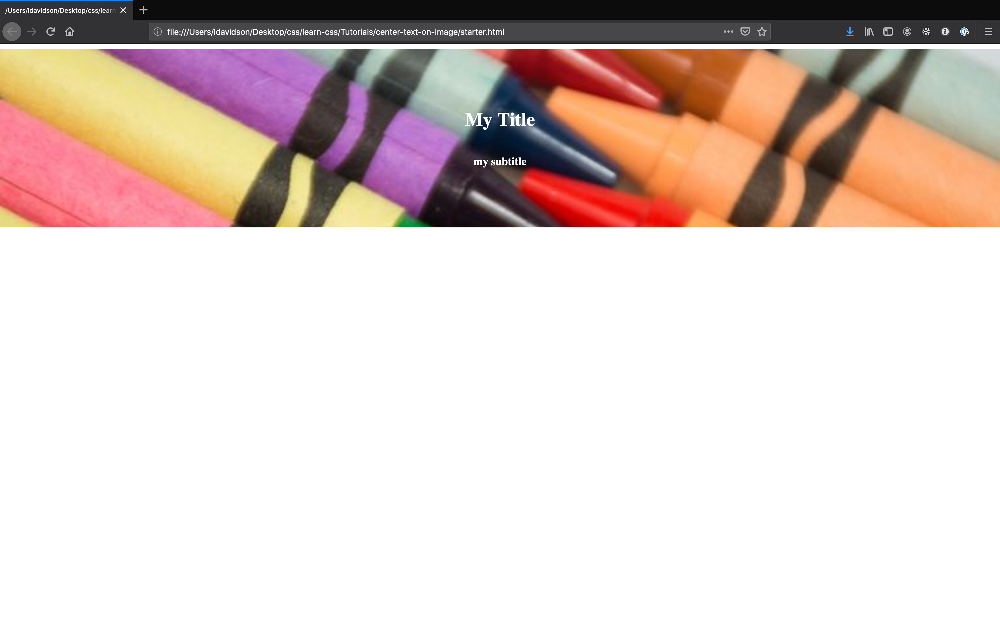

# Center Text on an Image Using Flexbox

`Flexbox Layout` is a CSS module that allows you to control how items on your page are aligned in their respective containers. What's a container? Well, a simple way to think about it is as any HTML element that wraps around-- "contains"-- other elements. We'll use a `<div>` as our flex container in this mini-tutorial.

Here's a good [complete guide to Flexbox](https://css-tricks.com/snippets/css/a-guide-to-flexbox/), if you're interested in reading more!

### Starting Points

This mini-tutorial just covers CSS, so we'll assume you have HTML for an image that you want to center a title over. It should look something like this:
```html
<div id="backgroundImg">
  <h1>My Title</h1>
  <h3>my subtitle</h3>
</div>
```
You'll also need an image to use as your background. You can use [this demo html](./starter.html) and [this sample image](./crayons.jpg) if you don't have your own.

### Adding a Stylesheet

If you don't already have a stylesheet in your project, the first thing you'll need to do is create a CSS file: `styles.css`. If you're using the demo HTML in this repo, there's a blank [`styles.css`](./styles.css) ready for you.

We'll then add the following link to our CSS in the `<head>` of our our HTML file:
```html
<link rel="stylesheet" href="styles.css">
```
### Writing the CSS
All of the following code goes in your `styles.css` file.

1. Add and size the background image:
```css
div#backgroundImg {
  background-image: url(/crayons.jpg);
  background-size: cover;
  width: 100vw;
  height: 300px;
}
```
  Using `cover` for the image size ensures that our image fills the entire `<div>` no matter the size of the user's screen.

2. Make the `<div>` containing the image a flexbox container oriented as a column:
```css
div#backgroundImg {
  background-image: url(/crayons.jpg);
  background-size: cover;
  width: 100vw;
  height: 300px;
  display: flex;
  flex-direction: column;
}
```
  We're using `column` here because we want our title and subtitle to stack on top of each other rather than spread out in a row.

3. Align the items in our flex column to center both vertically and horizontally:
```css
div#backgroundImg {
  background-image: url(/crayons.jpg);
  background-size: cover;
  width: 100vw;
  height: 300px;
  display: flex;
  flex-direction: column;
  justify-content: center;
  align-items: center;
}
```
  In flexbox `justify` deals with the primary axis, so in our case with a column the vertical one, while `align` sets the cross axis, in our case horizontal.

4. Set the font color on your title and subtitle so they're visible:
```css
h1 {
  color: white;
}
h3 {
  color: white;
}
```
That's it! Save your css file and open your html file in your browser.

### Result

