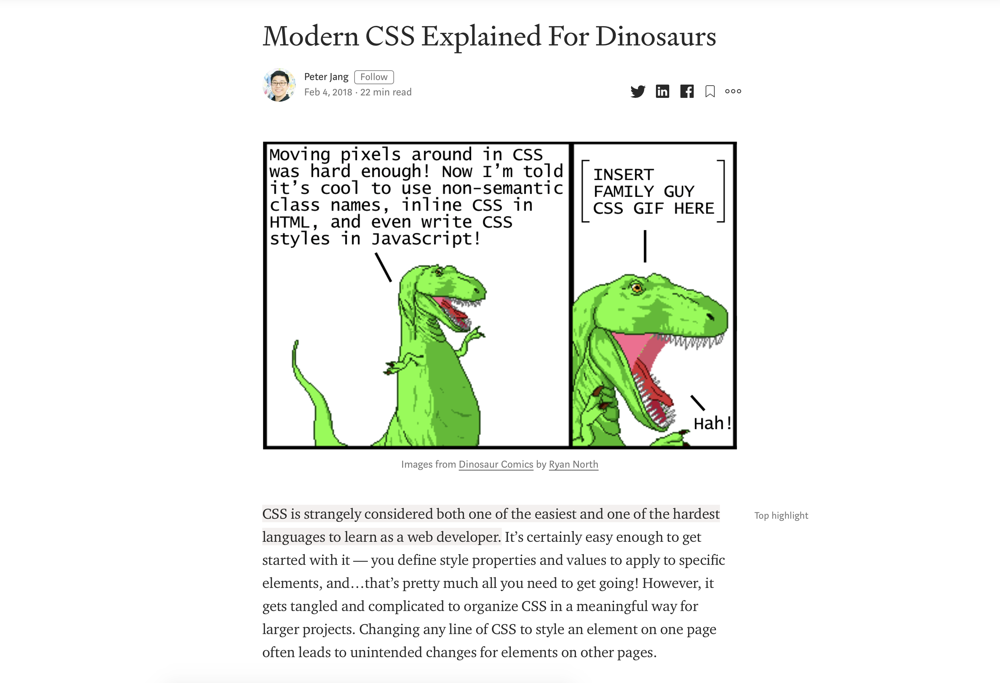

# Challenge Instructions

So you're ready to tackle the challenge-- great! The premise is straightforward: your goal is to recreate the layout of a [Medium post](https://medium.com/actualize-network/modern-css-explained-for-dinosaurs-5226febe3525) on CSS.

You can find a snapshot of just the portion you'll be recreating in [goal.png](./goal.png):

To get you started, we've added the text content to [starter.html](./starter.html). You'll want to download that file (or copy and paste the html from there into a new file on your computer) as your first step. Open your new HTML file in a browser, and you should see essentially unformatted text. Then you can either create a `styles.css` and update the `<link>` in the HTML `<head>` to point to your new file or simply work in your browser's style editor.

Everything you need to know to recreate this layout _should be_ in these tutorials. If you think this isn't right, definitely let us know what's missing! But we've also provided a [hint](./hint.png) about how to structure the final layout if you need help.

### Good luck! :smile:
