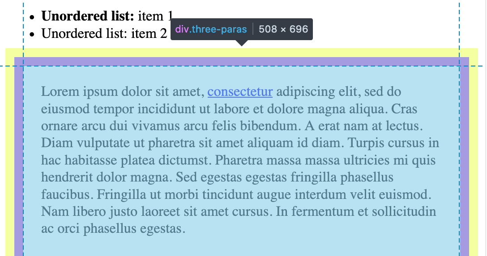
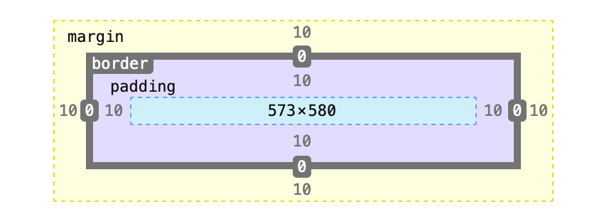
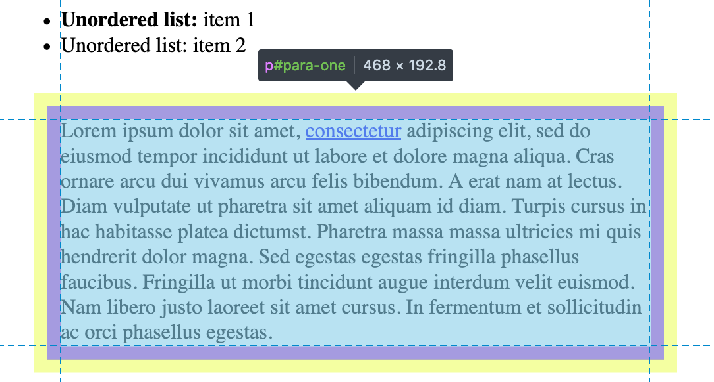
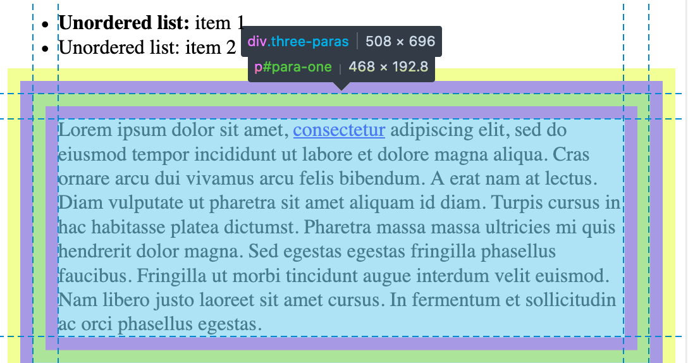
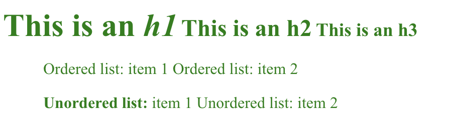
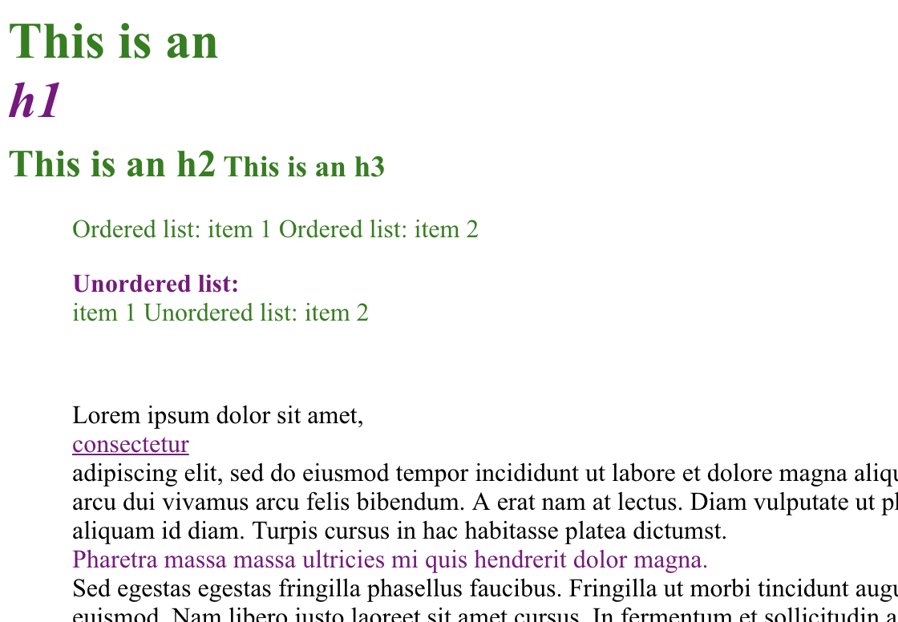

# Boxes I: The Box Model

The key to understanding **CSS layout** is to realize that everything—**everything**—lives in a box. This paragraph `<p>` lives in a box. The heading `<h1>` above it lives in a box. Everything on this page lives in its own little box, and we can control how things are arranged relative to one another by changing the properties attached to their boxes.

## Boxes all the way down
Let's try visualizing these invisible magic boxes.

Open up your browser and drag `sample.html` into it. Pull up your developer tools (`command-option-i` in any browser on a Mac), and look for a little icon that looks like this:  or this : . With this tool active, moving your cursor around the browser's viewport will highlight different DOM elements, as well as the boxes they live in.

## Margin and Padding

You'll notice that certain elements seem to live in concentric boxes, like Russian nesting dolls:


The color scheme will vary from browser to browser, but what Firefox is showing us here is that this particular `<div>` (with the class "three-paras") has some `margin` (the outer, yellow box) as well as some `padding` (the inner, purple box). The actual `border` of the box is where the yellow box meets the purple box, and the smaller blue box in the very middle is where the `content` of this `<div>` lives.

The **yellow `margin`** box appears to be about as far away from the **purple `padding`** box as the **blue `content`** box is from the purple `padding` box—we'd expect this `<div>` to have equal amounts of `margin` and `padding`...and indeed it does!

```
.three-paras {
  padding: 10px;
  margin: 10px;
}
```

If you're using Firefox, you can see a nice visualization of the box model right in your developer tools:



But wait a second—if the blue box is where the `<div>`'s content is supposed to live, why isn't the fake Latin going all the way out to the edges? What's with all that space around the text?



Turns out the `<p>` holding that text has `margin` and `padding` values of its own:
```
#para-one, #para-two, #para-three {
  padding: 10px;
  margin: 10px;
}
```

If we overlay the `<p>`'s boxes with the `<div>`'s, we can see that the `<p>`'s `margin` begins right where the `<div>`'s `padding` ends, at the outer dotted blue line that marks the edge of the `<div>`'s `content` box:



If the `<p>` didn't also have `margin` and `padding` values, the `content` boxes of the `<div>` and the `<p>` would have been the same size. But since it does, the text gets pushed inwards even further, making the `<p>`'s `content` box smaller (by 20px) than the `<div>`'s.

#### TL;DR:
- `margin` pushes other elements **outwards**
  - affects things outside the box
- `padding` pushes other elements **inwards**
  - affects things inside the box, a.k.a. content.

## Display: Inline vs Block
Ever notice how headings `<h#>` and list items `<li>` always seem to start a new line in HTML? These elements have the property `display: block` by default, which means they always take up a whole line by themselves, and will not share with anything else.  We can override this behavior by declaring a style:
```
h1, h2, h3, li {
  display: inline;
  color: green;
}
```


Other elements like `<a>`(anchor or link), `<strong>`(bold text), `<em>` (italicized text, think "emphasis"), and `<span>` ( inline container, usually used as a way of selecting some text within a paragraph that can then be styled) have `display:inline`
 by default, and are happy to share their space with other inline elements.
 Again, we can override this with a style and turn them into bad neighbors:
 ```
 a, strong, em, span {
   display: block;
   color: purple;
 }
```


#### TL;DR:
- `inline` elements can appear on the same line as other inline elements.
- `block` elements always require their own line.

## Display: None
No screenshot for this one, it does what it says on the box.
