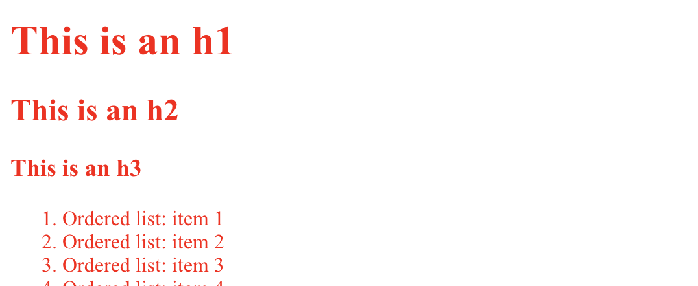
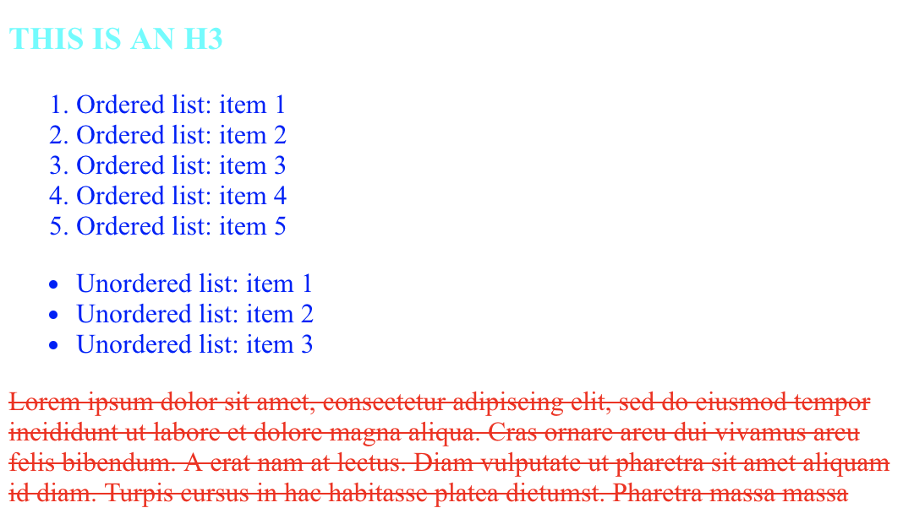
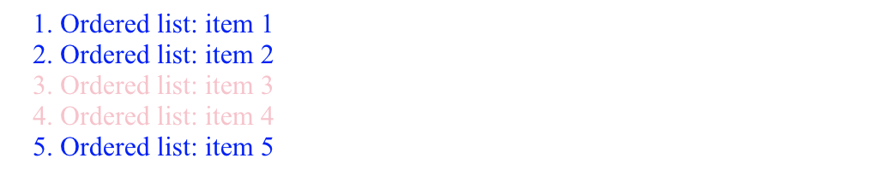
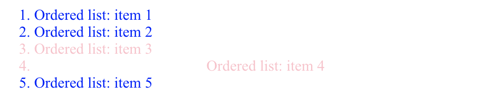
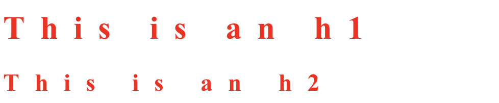
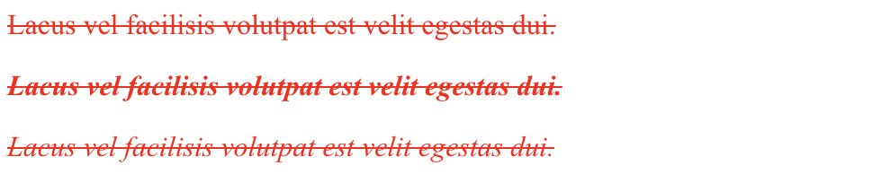
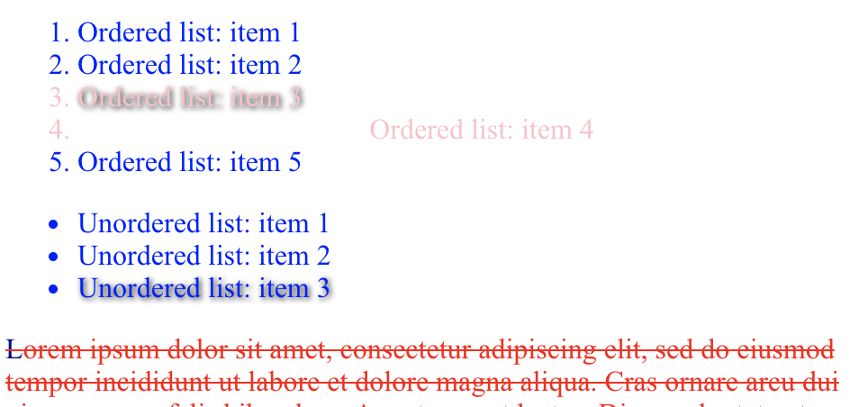

# Selectors 101
CSS wouldn't work very well if every rule applied to every element of the DOM all the time—it needs a way to be **specific** about which rules apply to whom. **Selectors** to the rescue!

Let's look at a few of the most useful ones.

## `*`: Universal selector
```
* {
  color: red;
}
```

_"Select everything and make it all red."_



## Type selectors
```
h3 {
  text-transform: uppercase;
  color: aqua;
}

li {
  color: blue;
}

p {
  text-decoration: line-through
}
```

_"Make `h3` headings uppercase and aqua, make all list items blue, and give paragraph text a strikethrough."_



## `.`: Class selector
```
<ol>
  <li>Ordered list: item 1</li>
  <li>Ordered list: item 2</li>
  <li class="special">Ordered list: item 3</li>
  <li class="special">Ordered list: item 4</li>
  <li>Ordered list: item 5</li>
</ol>
```
```
.special {
  color: pink;
}
```

_"Make every element with the class "special" pink."_[^1]

[^1]: Many elements can share the same class in a document; the class selector selects all of them at the same time.



## `#`: ID selector
```
<ol>
  <li>Ordered list: item 1</li>
  <li>Ordered list: item 2</li>
  <li class="special">Ordered list: item 3</li>
  <li class="special" id="extraspecial">Ordered list: item 4</li>
  <li>Ordered list: item 5</li>
</ol>
```
```
#extraspecial {
  text-align: center;
}
```

_"Make the single element with the ID "extraspecial" center-aligned."_[^2]

[^2]: Unlike classes, IDs are unique.



## `,`: Grouping selectors
```
h1, h2 {
  letter-spacing: 15px;
}
```

_"Make a group containing all `h1` and `h2` headings, and give the group a letter-spacing of 15px."_




## ` ` and `>`: Descendants and children
```
<p>Lacus vel facilisis volutpat est velit egestas dui.</p>
<div id="outer">
  <p>Lacus vel facilisis volutpat est velit egestas dui.</p>
  <div id="inner">
    <p>Lacus vel facilisis volutpat est velit egestas dui.</p>
  </div>
</div>
```
```
#outer p {
  font-style: italic;
}
#outer > p {
  font-weight: bold;
}
```
_"Italicize all paragraph text within the element with the ID "outer". While you're in there, make all paragraph text directly under "outer" bold."_



## `:` and `::`: Pseudo classes and pseudo elements
```
li:nth-child(3) {
  text-shadow: 1px 1px 4px black;
}

p::first-letter {
  color: navy;
}
```
_"Take every third instance of a group of list items, and give it a black shadow. Also, make the first letter of every paragraph navy."_[^3]

[^3]: Pseudo selectors select elements based on properties that aren't part of HTML markup, such as relative position (as shown here), and state (e.g. text highlighted by the user).


