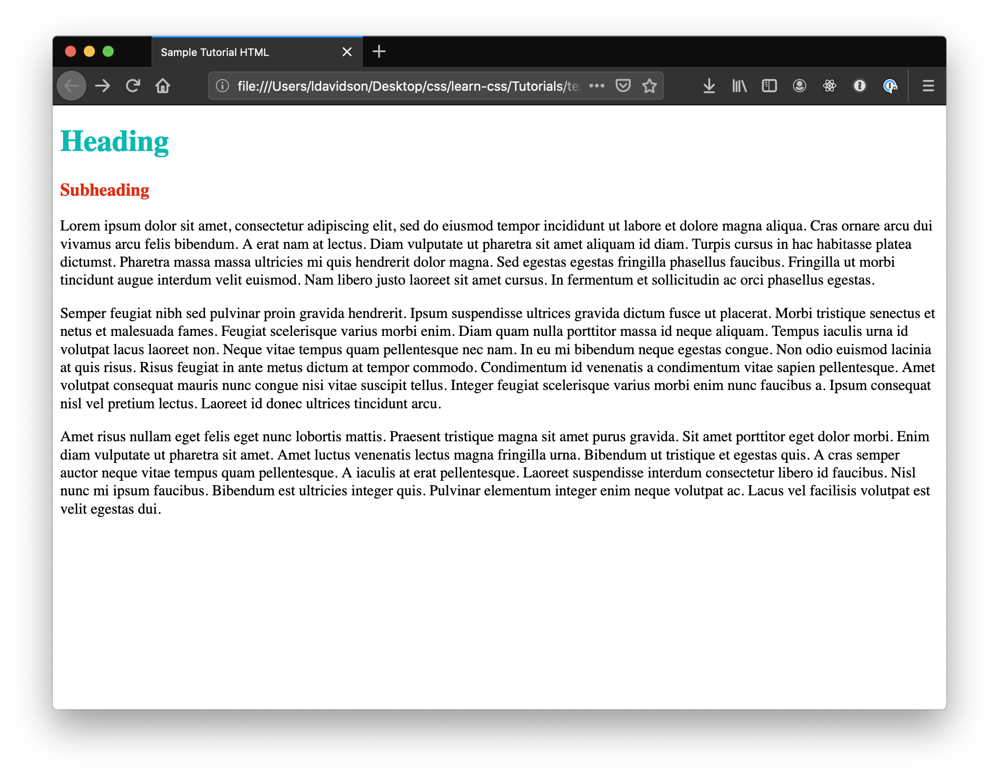
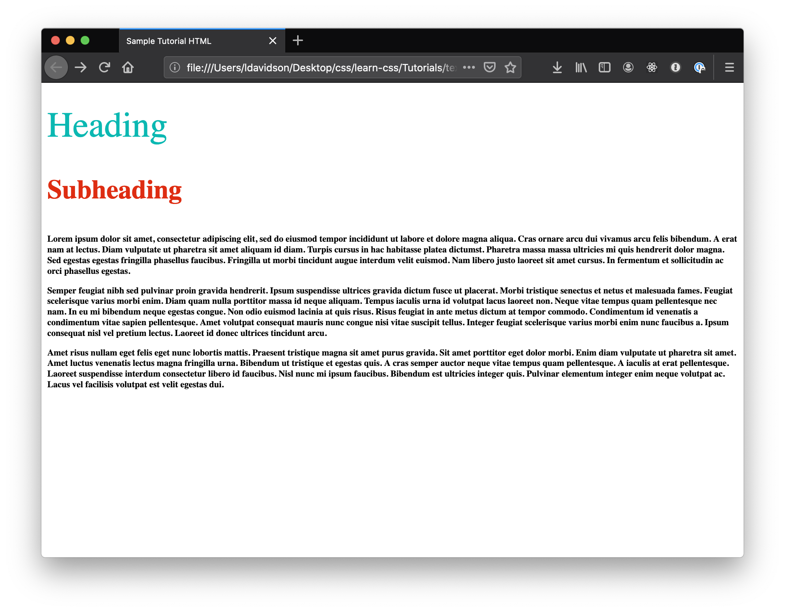
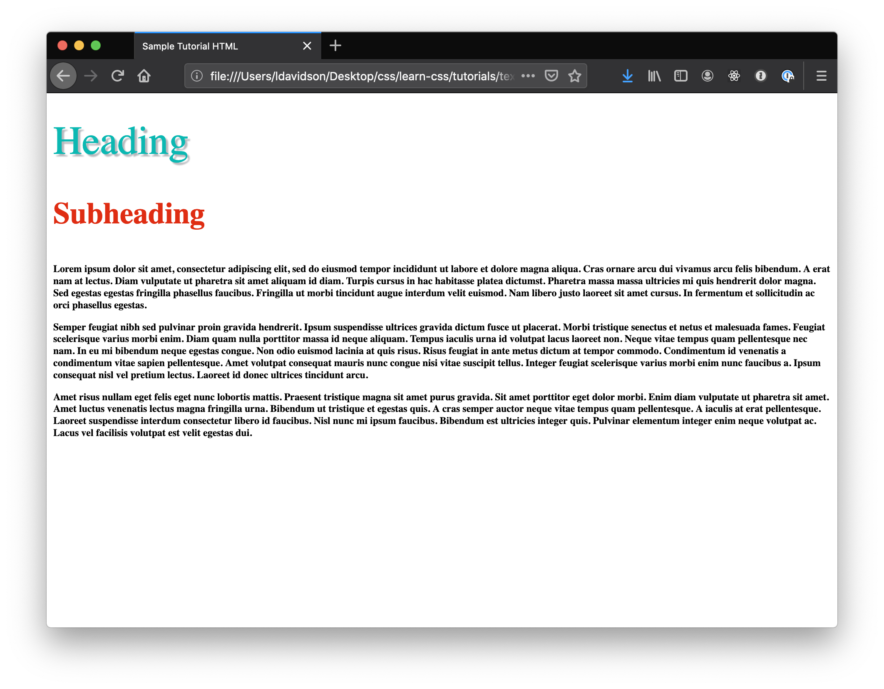
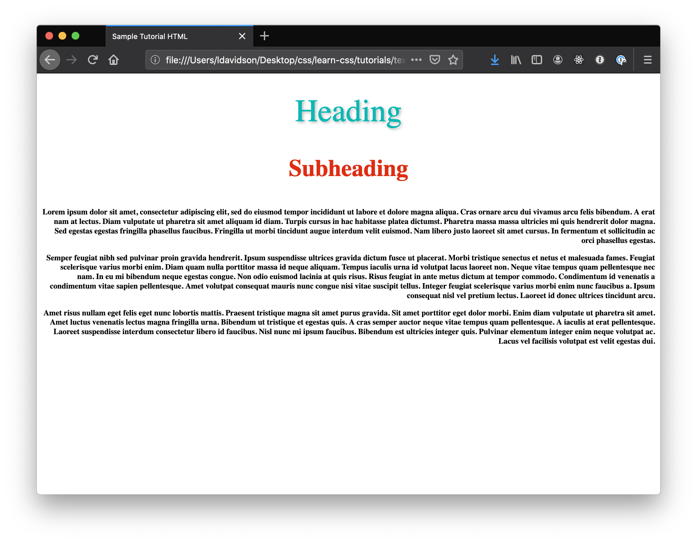

# Text Styling Basics

&nbsp;  
There are lots of things you can do with text in CSS! We'll just cover a few key properties in this mini-tutorial, but once you understand the basics, you should be able to look up additional text formatting properties and apply them:

- [Color](#color)
- [Size & Weight](#size--weight)
- [Shadow](#shadow)
- [Alignment](#alignment)
- [Line Height](#line-height)

Here is a good [guide to text styling](https://developer.mozilla.org/en-US/docs/Learn/CSS/Styling_text/Fundamentals) with a built in editor at the bottom for trying things out.

## Requirements

This mini-tutorial works with either HTML or markdown. You can use any text tags you like, but we'll reference these three in the tutorial:

**HTML:**
```html
<h1>Heading</h1>
<h3>Subheading</h3>
<p>This is a paragraph. Here we'd want a larger chunk of text to style.</p>
```
**Markdown:**
```gfm
# Heading
### Subheading
This is a paragraph. Here we'd want a larger chunk of text to style.
```
&nbsp;  

## CSS Text Properties

All of the following code, or any of it that you choose to use, goes in your `styles.css` file. Note that in this mini-tutorial, there is no "final" product. Instead we'll try out a variety of text styles that you might want to use in your own projects.

### Add Selectors

Before we can make any changes to our text, we need to add the relevant "selectors" to our `styles.css`. Selectors are what the HTML elements like `p` and `h1` are called in CSS.  

In the demo HTML, we only have three types of text elements, so we'll add those three selectors to our styles:
```css
h1 {

}
h3 {

}
p {

}
```
If you have more in your HTML file, go ahead and add those in as well.

### Color

First we'll add some color. Some basic colors like `blue`, `black`, `purple`, etc. can be used by name, but you can choose any color by finding its [hex color code](https://www.google.com/search?q=color+picker). Here's the demo text with some random colors:
```css
h1 {
  color: #0bb8b2;
}
h3 {
  color: #de2d12;
}
p {
  color: black;
}
```


### Size & Weight

Next, we'll set our font size and weight. You can use a [variety of units](https://developer.mozilla.org/en-US/docs/Learn/CSS/Building_blocks/Values_and_units) for size, including absolute units, like pixels `px`, and relative units, like percentages `%`. Just be careful when using relative units, making sure that you know what the size is being calculated relative to. We'll stick with pixels for this demo:
```css
h1 {
  color: #0bb8b2;
  font-size: 48px;
}
h3 {
  color: #de2d12;
  font-size: 36px;
}
p {
  color: black;
  font-size: 12px;
}
```
Font weight determines how bold the font is. You'll typically use only `regular` or `bold`, but you can also use numerical values from 100-900, if you want more precise weights. Heading elements are also bold by default in most browsers. But let's mix things up a bit!
```css
h1 {
  color: #0bb8b2;
  font-size: 48px;
  font-weight: 100;
}
h3 {
  color: #de2d12;
  font-size: 36px;
  font-weight: 800;
}
p {
  color: black;
  font-size: 12px;
  font-weight: bold;
}
```

Here's the demo at this point:


### Shadow

Now let's add some drop shadows to our heading. For this, we'll use the property `text-shadow`. This property takes four values:
1. The right-left offset of the shadow. Use a negative number to move the shadow left.
2. The vertical offset. Use a negative number to move the shadow up.
3. The blur radius. How much do you want your shadow to spread?
4. The color. Accepts the same types of color values as we used for the text itself.

```css
h1 {
  color: #0bb8b2;
  font-size: 48px;
  font-weight: 100;
  text-shadow: 2px 2px 4px #b7b9bd;
}
h3 {
  color: #de2d12;
  font-size: 36px;
  font-weight: 800;
}
p {
  color: black;
  font-size: 12px;
  font-weight: bold;
}
```
Here's the demo with the shadow:


### Alignment

Next you might want switch up your text alignment. You might want to center your heading. Or perhaps you have an image next to one of your paragraphs and you want to right justify your text. Here's how to do that:
```css
h1 {
  color: #0bb8b2;
  font-size: 48px;
  font-weight: 100;
  text-shadow: 2px 2px 4px #b7b9bd;
  text-align: center;
}
h3 {
  color: #de2d12;
  font-size: 36px;
  font-weight: 800;
  text-align: center;
}
p {
  color: black;
  font-size: 12px;
  font-weight: bold;
  text-align: right;
}
```
We used the property `text-align`, which does just what it says, aligns the text. This property takes the values `center`, `left`, `right`, and `justify`. Note, however, that when using `text-align` your text will by default be aligned with respect to the immediate parent. In this case, our text elements live just under `<body>`, which fills the whole screen, but if they lived in a smaller `<div>` they'd be centered or right justified accordingly. Here's the result of the css additions above:


### Line Height
