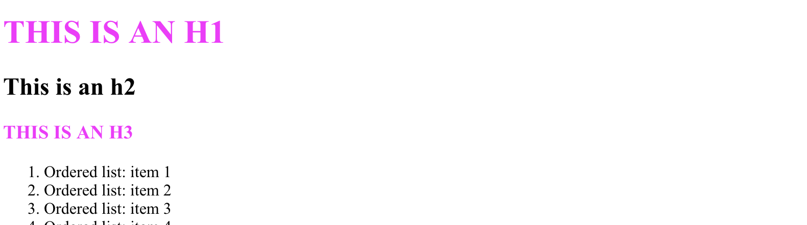
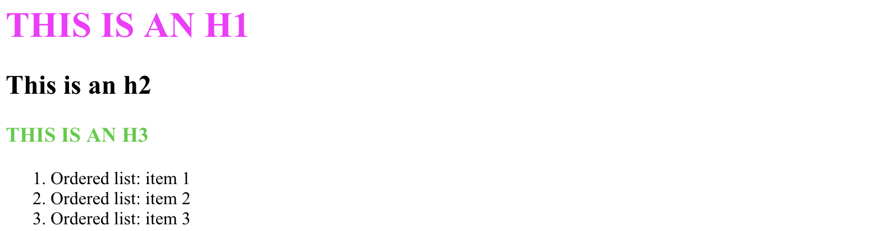
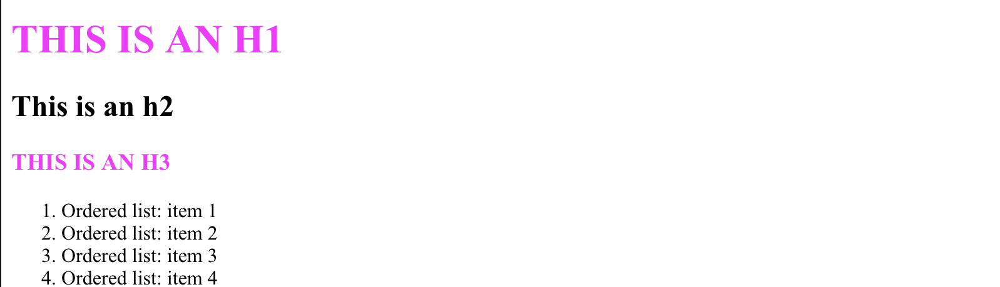
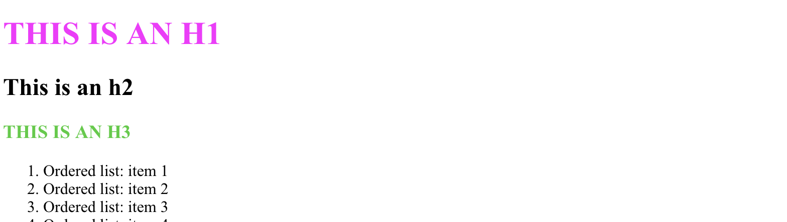
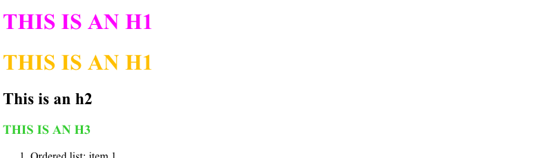

# Why Cascading?

You've probably read somewhere that "CSS" is short for "Cascading Style Sheets". "Style" and "sheet" are pretty intuitive—**sheets** that define the **styling** for a web page. But where on earth does "cascading" come from?

## CSS is all about rules.
We create a consistent style by defining rules that apply everywhere on a page.
```
h1, h3 {
  color: magenta;
  text-transform: uppercase;
}
```

_"All `h1` or `h3` headings should be fuchsia and uppercase"_





## What happens when rules collide?
Let's throw a new rule into the mix:
```
h1, h3 {
  color: magenta ;
  text-transform: uppercase;
}

h3 {
  color: lime ;
}
```

_"All `h1` or `h3` headings should be fuchsia and uppercase" ; "All `h3` headings should be lime"_



Looks like the lime rule wins. But what if we switch the order?
```
h3 {
  color: lime ;
}

h1, h3 {
  color: magenta ;
  text-transform: uppercase;
}
```
_"All `h3` headings should be lime" ; "All `h1` or `h3` headings should be fuchsia and uppercase"_



Whichever rule is defined last in the stylesheet gets the final say. Can we override this and make a higher-up rule more important?

```
h3 {
  color: lime !important;
}

h1, h3 {
  color: magenta ;
  text-transform: uppercase;
}
```
_"HI HELLO THIS IS IMPORTANT!!!!! All `h3` headings should be lime" ; "All `h1` or `h3` headings should be fuchsia and uppercase"_



Yes we can—but should we? We'll come back to that later.

## Rules can come from different places.

It's common practice to **separate content (HTML) from styles (CSS)**, which is why we've been writing our styles in a separate `.css` file. This helps keep our code **modular:** we can swap between different stylesheets for the same html document, and apply the same stylesheet to different documents for a consistent look and feel.

But stylesheets aren't the only place you might find CSS rules. Occasionally you'll see styles defined inline:
```
<h1>This is an h1</h1>
<h1 style="color:gold">This is an h1</h1>
```
```
h1, h3 {
  color: magenta ;
  text-transform: uppercase;
}
```
Here we have two separate `h1` elements, but one of them has an inline style property set on it.

Even though our stylesheet says all `h1`s have to be fuchsia, the inline style overrides the color on the second `h1` and makes it gold.



Sometimes you'll find styles doing their thing even when you never defined them. Look at how Safari, Chrome, and Firefox each render these unstyled elements:

```
<ul>
  <li>Unordered list: item 1</li>
  <li>Unordered list: item 2</li>
  <li>Unordered list: item 3</li>
</ul>
<input type="text">
```


Since we never declared any styles for these elements, we're effectively telling the browser it's okay to apply its default rules. Each browser ends up doing something slightly different: Safari has larger bullets and a grey border around the text field, Chrome has a more pronounced glow effect around the text field, and Firefox has the smallest bullets and the most subtle highlight.

Rules defined in stylesheets or inline (**"author"** styles) will always override these browser defaults (**"user-agent"** styles), but it's important to remember that elements will always look subtly different from browser to browser unless you tell them not to by declaring styles on them.

## Cascading is just a ranking of rules!
Because rules can come from multiple places, it's actually **very** common for rules to clash with one another. The **cascade algorithm** is how the browser figures out which rule beats all the others in a contest, i.e. which rule it should ultimately follow.

In descending order of importance:
1. **!important > not ; declared > default**
   * For any two rules, the algorithm first looks to see if either of them is marked `!important`.
   * If only one rule is `!important`, that one wins and the game is over.
   * If both rules are `!important` or neither one is, the algorithm's next move is to look at where they came from: declared **"author"** styles beat the implicit **"user-agent"** defaults applied by the browser.
     - **"user"** styles are also a thing, and sit between author and user-agent styles in priority, but we won't worry about them too much; they're rarely encountered.
   * If there's no clear winner after importance and origin have been considered, we go to step 2.


2. **more specific > less specific**
   * For any two rules, the more specific one wins.
   * **Inline** (`style=`) > **ID** (`#`) > **Class** (`.`) > **type** (e.g. `<h1>`, `<em>`, `<div>`).


3. **later > earlier**
   * If somehow we end up with multiple rules of equal importance and specificity, we turn to **source order** as the tie-breaker.
   * Within a stylesheet, the rule that comes last wins.
   * If more than one stylesheet is loaded, rules from later stylesheets beat rules from earlier stylesheets.

## Don't abuse `!important`
_Because_ `!important` is so powerful, you should be very intentional about how you use it. Too many `!important` flags can lead to unexpected behavior that will be frustrating for you and whoever else wants to modify your styles down the road.

## Specificity is your friend—until it isn't.
Specificity is a more responsible tool for defining predictable, durable styling rules, but don't get carried away! Overly-specific styles can be just as hard to read and annoying to debug as too many `!important`s. Use only as many selectors as you need to get the job done.

## Now go forth and style!
But before you do, play around with defining clashing rules in `finished_styles.css` to make sure you understand how the cascade works.
